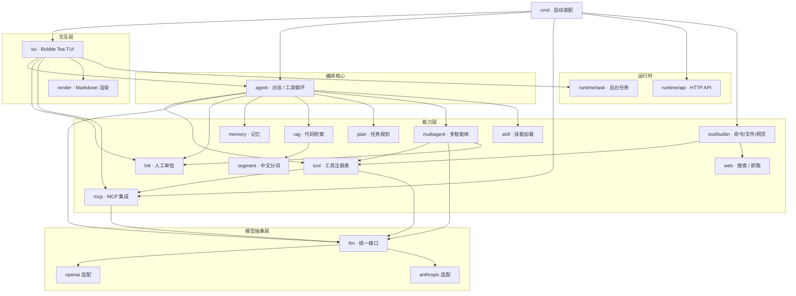

# lioncli

[](https://github.com/Inumoroha/lioncli/actions/workflows/ci.yml)
[](go.mod)

`lioncli` 是一个用 Go 编写的终端智能体 CLI。它提供 TUI 聊天界面，把 LLM、工具调用、MCP、技能、记忆、RAG 代码检索、规划执行、多智能体协作和人工审批串在一起，适合在本地项目目录里做开发辅助和自动化任务。

## 功能

- 终端 TUI：基于 Bubble Tea 的交互式聊天界面。
- 工具调用：内置命令执行、文件读写、网页搜索、网页抓取、技能加载等工具。
- MCP 集成：可加载 `mcp.json`，把 MCP server 的 tools/resources 暴露给模型。
- HITL 审批：危险工具、MCP 写操作等可以在 TUI 中人工确认。
- 图片输入：支持 `@image:<path>` 和 `@clipboard` 图片附件。
- 记忆系统：支持短期记忆、长期事实记忆、token 用量展示。
- 规划与协作：支持 `/plan` 规划执行和 `/team` 多智能体协作。
- RAG 代码检索：支持 `/index` 建立代码索引，`code_search` 工具检索项目代码。
- Runtime API：可选开启本地 HTTP runtime API。

## 架构

整体分层：`cmd` 负责装配，`tui` 负责交互，`agent` 是编排核心（驱动「对话 → 工具调用 → 结果」循环），下面挂着各能力模块，最底层是统一的 `llm` 抽象（屏蔽 OpenAI / Anthropic 协议差异）。`tool` 注册表把本地内置工具和 MCP 远程工具收进同一个池子，`agent` 只面对统一接口、不关心工具实现在本地还是走 MCP 子进程。



## 环境要求

- Go `1.25.5` 或兼容版本
- 一个 OpenAI 兼容的 Chat Completions API
- 可选：SerpAPI key，用于 `web_search`
- 可选：Embedding 服务，用于 `/index` 和 `code_search`
- 可选：MCP server 配置

## 快速开始

1. 克隆并进入项目：

```powershell
git clone https://github.com/Inumoroha/lioncli.git
cd lioncli
```

2. 准备 `.env`：

```env
AI_API_KEY=your_api_key
AI_BASE_URL=https://api.openai.com/v1
AI_MODEL=deepseek-chat

# 可选：联网搜索
SERPAPI_API_KEY=

# 可选：代码索引/检索
EMBEDDING_PROVIDER=ollama
EMBEDDING_MODEL=nomic-embed-text:latest
EMBEDDING_BASE_URL=http://localhost:11434
EMBEDDING_API_KEY=
```

3. 运行：

```powershell
go run ./cmd
```

没有 API key 时可以用本地 demo 模式检查 TUI 是否能启动：

```powershell
$env:TEACLI_DEMO_MODE="true"
go run ./cmd
```

## 常用命令

在 TUI 输入框中可以使用这些命令：

```text
/help                         显示帮助
/commands [query]             搜索命令
/tools                        查看当前注册工具
/mcp                          查看 MCP 状态
/plan <goal>                  将目标拆成任务并执行
/team <goal>                  运行多智能体协作
/index [path]                 为项目建立代码索引
/memory [status|facts|clear|forget]
/hitl [on|off|status|clear]   配置人工审批
/task [add|cancel|log] ...    管理后台任务队列
```

图片输入：

```text
请分析这张图 @image:<./screenshots/error.png>
请看剪贴板里的截图 @clipboard
```

## MCP

默认会向上查找：

```text
internal/mcp/mcp.json
```

也可以指定自定义配置：

```powershell
$env:TEACLI_MCP_CONFIG="C:\path\to\mcp.json"
go run ./cmd
```

启动后，MCP tools 会同步到统一工具注册表；resources 能通过 `mcp_list_resources` 和 `mcp_read_resource` 暴露给模型。

## Runtime API

默认关闭。开启需要同时设置启用开关和 API key：

```powershell
$env:TEACLI_RUNTIME_API_ENABLED="true"
$env:TEACLI_RUNTIME_API_KEY="your_local_api_key"
$env:TEACLI_RUNTIME_API_ADDR="127.0.0.1:0"
go run ./cmd
```

运行时会在 stderr 输出监听地址。

## 开发

运行测试：

```powershell
go test ./...
```

构建：

```powershell
go build -o lioncli.exe ./cmd
```

项目结构：

```text
cmd/                 CLI 入口
internal/agent/      Agent 主循环、工具执行、事件桥接
internal/tui/        终端界面
internal/tool/       工具注册表和内置工具
internal/mcp/        MCP 管理器
internal/hitl/       人工审批
internal/prompt/     系统提示词装配
internal/memory/     记忆与上下文压缩
internal/rag/        代码索引与检索
internal/image/      图片附件和剪贴板处理
internal/runtime/    任务队列和 Runtime API
internal/render/     终端渲染辅助
```

## 注意

- `.env` 已被 `.gitignore` 忽略，不要提交密钥。
- `main.exe`、本地缓存、个人 MCP 配置等本机产物不应入库。
- `code_search` 依赖先执行 `/index` 建立索引；未建立索引时检索结果可能为空或报错。
- 浏览器类 MCP 工具建议保持 HITL 开启，避免误操作敏感页面。
